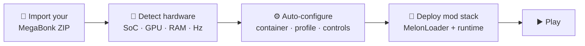

<div align="center">


# MegaBonk Mobile Port

### The full PC experience of **MegaBonk** — on Android.

*One-tap setup · Adaptive device tuning · Full MelonLoader mod support*

**A specialized Android launcher that runs the PC version of [MegaBonk](https://store.steampowered.com/app/3229250/Megabonk/)**
**through Wine + Box64 — with everything pre-configured, from the Wine container to the mod loader.**

</div>

> [!IMPORTANT]
> **This repository contains no game content.** You must import a ZIP of your own
> legally-owned MegaBonk PC copy. See the [Legal Notice](#%EF%B8%8F-legal-notice).

---

## 📖 Table of Contents

- [What is this?](#-what-is-this)
- [Features](#-features)
- [Quick Start](#-quick-start)
- [Automatic Device Tuning](#-automatic-device-tuning)
- [Mod Support](#-mod-support)
- [Performance Engineering](#-performance-engineering)
- [Repository Layout](#-repository-layout)
- [Building](#-building)
- [Legal Notice](#%EF%B8%8F-legal-notice)
- [Credits](#-credits)

---

## 🤔 What is this?

MegaBonk is a **Windows x86_64** game (Unity, IL2CPP). Running it on a phone normally
means hand-tuning a Wine container, drive mappings, screen sizes, env vars, CPU
affinity, DX wrappers — and even then, **mods simply don't load** without
Wine-specific surgery (see [WHATS-NEW.md](WHATS-NEW.md) for all four fixes).

This project does all of it for you:



The result is a **one-tap experience**: import your game ZIP once, tap `Play`.

---

## ✨ Features

<table>
<tr>
<td width="50%" valign="top">

### 🎮 Game Import

- **Bring-your-own game** — the APK ships *zero* game files
- **Smart ZIP importer** — finds the game root at any folder depth, auto-detects
  the `.exe` (even renamed), validates the `*_Data` directory
- Skips redistributable junk (`_commonredist`, `redist`, `__MACOSX`)
- Zip-slip path-traversal protection
- Import button auto-hides once the game is installed

</td>
<td width="50%" valign="top">

### 🧠 Automatic Device Tuning

- Reads **SoC, GPU, core count, RAM, refresh rate** → assigns a tier
  (HIGH / UPPER-MID / MID / LOW)
- **Aspect-matched resolutions** — fullscreen resolution derived from a
  per-tier pixel budget, preserving your exact screen ratio (no letterbox box)
- Auto-selects GPU driver, Box64 preset, FPS cap, CPU core pinning
- Everything overridable in <kbd>Game Settings</kbd>

</td>
</tr>
<tr>
<td width="50%" valign="top">

### 🧩 Mod Support

- **MelonLoader 0.6.6** (Apache-2.0) deployed automatically
- **MegabonkTweaks** bundled: vsync off · 40 m shadows · MSAA off
- **Mods manager UI** — import your own `.dll` mods, list, remove
- Works **fully offline** — no first-run downloads needed

</td>
<td width="50%" valign="top">

### 🛠️ Performance Engineering

- **Box64 dynarec cache** persists across launches — JIT cost paid once
- **boot.config patching** — Unity gfx-jobs disabled (reversible, backed up)
- **Benchmark harness** in `tools/` — frame times, 1%/0.1% lows, thermal data
- **Big-core pinning** — game threads stay on the fast cluster

</td>
</tr>
</table>

> [!TIP]
> Every optimization in this project was **measured, not guessed** — the
> benchmark harness in [`tools/`](tools/README.md) captures SurfaceFlinger
> frame-latency data before and after each change.

---

## 🚀 Quick Start

1. **Install the APK** and open the launcher
2. Tap <kbd>Import Game ZIP</kbd> and pick the ZIP of your legally-owned MegaBonk PC copy
3. The port configures *everything* — container, shortcut, touch layout, performance profile
4. Tap <kbd>PLAY</kbd> — that's it

> [!NOTE]
> First launch deploys the mod stack automatically. Subsequent launches skip
> straight to the game.

<details>
<summary><b>📋 Requirements</b></summary>

- Android 8.0 or newer
- 64-bit ARM device (`arm64-v8a`)
- Your legally-owned copy of MegaBonk (PC version) as a ZIP
- Enough free storage for the extracted game files

</details>

---

## 🧠 Automatic Device Tuning

| Tier | Example hardware | Resolution budget | FPS cap | Driver | Box64 |
|:---:|---|:---:|:---:|:---:|:---:|
| 🟢 **HIGH** | SD 8 Gen 2+, Adreno 740+ | 1.4 M px | uncapped | auto | PERFORMANCE |
| 🟡 **UPPER-MID** | SD 6/7 Gen, Adreno 710 | 640 K px | 45 | auto | PERFORMANCE |
| 🟠 **MID** | Older SD / mid Mali | 450 K px | 30 | System | COMPATIBILITY |
| 🔴 **LOW** | Budget / unknown | 340 K px | 30 | System | COMPATIBILITY |

> Example: **Galaxy A36 5G** (SM6475 · Adreno 710 · 60 Hz) → 🟡 UPPER-MID →
> `1174×542` at exactly 19.5:9 fullscreen, System driver (Turnip SIGSEGVs on
> this SoC), Box64 PERFORMANCE, 4 big cores.

---

## 🧩 Mod Support

Open the <kbd>Mods</kbd> button on the launcher:

- **Import** your own `.dll` mods from device storage (multi-select)
- Installed mods are listed; removal is one tap
- The bundled **MegabonkTweaks** is shown as built-in and protected
- Mods land in the game's `Mods/` directory and load on next launch

On-device, the loader boots like this:

```text
[Il2CppAssemblyGenerator] Assembly is up to date. No Generation Needed.
Loading Mods from 'D:\Megabonk\Mods'...
Melon Assembly loaded: '.\Mods\MegabonkTweaks.dll'
1 Mod loaded.
```

<details>
<summary><b>🔬 Why mods don't work out of the box (and the four fixes)</b></summary>

1. **Wine's builtin `version.dll` shadows the proxy** → `native,builtin`
   registry DllOverride for the doorstop proxy
2. **No .NET runtime in the guest** → portable .NET 6 runtime shipped as an
   APK asset, extracted to `<game>/dotnet/`
3. **MelonLoader 0.7.3's native bootstrap demands a 274 GB memory
   reservation** → instant crash under Wine/Box64 → downgraded to the
   Wine-compatible **0.6.6** line
4. **Cpp2IL.exe GC heap init fails (`0x8007000E`)** → forced Workstation GC
   via `COMPLUS_gcServer=0` — plus **PC-pre-generated interop assemblies**
   so the phone never generates anything at all

Full details, tool versions, and the uppercase-SHA-512 gotcha in
[**WHATS-NEW.md**](WHATS-NEW.md).

</details>

---

## ⚡ Performance Engineering

- **Dynarec cache persistence** — `BOX64_DYNAREC_SAVEFILE` points into app
  storage; translated code blocks survive across launches
- **boot.config optimization** — `gfx-enable-gfx-jobs 1 → 0` with a pristine
  backup (`boot.config.mobilebonk_orig`); toggle in settings
- **Measured workflow** — `tools/benchmark.sh` + `tools/analyze_frames.py`
  produce FPS, p50/p95/p99, 1%/0.1% lows, and thermal stats from
  SurfaceFlinger latency data

```bash
tools/benchmark.sh 30        # capture 30 s of frames on-device
python3 tools/analyze_frames.py tools/reports/<report>.txt
```

---

## 📁 Repository Layout

```
app/src/main/java/com/winlator/cmod/megabonk/
├── MegabonkSetup.java            # Container / shortcut / optimizer orchestration
├── MegabonkGameOptimizer.java    # VC++ runtime, MelonLoader, pregen interop, boot.config
├── DeviceProfileDetector.java    # Hardware tier detection + resolution budgets
├── MegabonkModsFragment.java     # Mods manager UI
└── MegabonkSettingsFragment.java # Game settings UI
melonloader-mod/                   # MegabonkTweaks mod source (C#, net6.0)
tools/                             # Benchmark harness (bash + Python)
app/src/main/assets/               # MelonLoader, portable .NET, pregen interop, VC++ runtime
```

---

## 🔧 Building

Requirements: **Android Studio** (SDK 34 + NDK) and **Java 17**.

```bash
./gradlew :app:assembleRelease
```

> [!WARNING]
> The game directory `app/src/main/assets/game/` is intentionally absent and
> git-ignored — the APK must never ship game content. To rebuild the mod DLL:
> `cd melonloader-mod && dotnet build -c Release` (toolchain versions in
> [WHATS-NEW.md](WHATS-NEW.md)).

---

## ⚠️ Legal Notice

> [!IMPORTANT]
> **You must legally own MegaBonk to use this project.**
>
> - This repository **does not contain, and never distributes**, any MegaBonk game files
> - The bundled MelonLoader is Apache-2.0 · the portable .NET runtime is MIT ·
>   the VC++ runtime is Microsoft's freely redistributable installer content
> - Do not use this project to obtain MegaBonk without purchasing it
> - Please support the original developer, **Vedinad**

---

## 🙏 Credits

| Project | Role |
|---|---|
| [Winlator Bionic](https://github.com/Pipetto-crypto/winlator) → [Ludashi 3.0](https://github.com/StevenMXZ/Winlator-Ludashi) | Base fork |
| [MelonLoader](https://github.com/LavaGang/MelonLoader) | Mod loader (Apache-2.0) |
| [Box64](https://github.com/ptitSeb/box64) · [Wine](https://www.winehq.org/) · [DXVK](https://github.com/doitsujin/dxvk) | Emulation stack |
| [MegaBonk](https://store.steampowered.com/app/3229250/Megabonk/) by Vedinad | The game |

---

<div align="center">

**MegaBonk Mobile Port** — built by the community, for the community.

*Not affiliated with or endorsed by Vedinad.*

</div>
